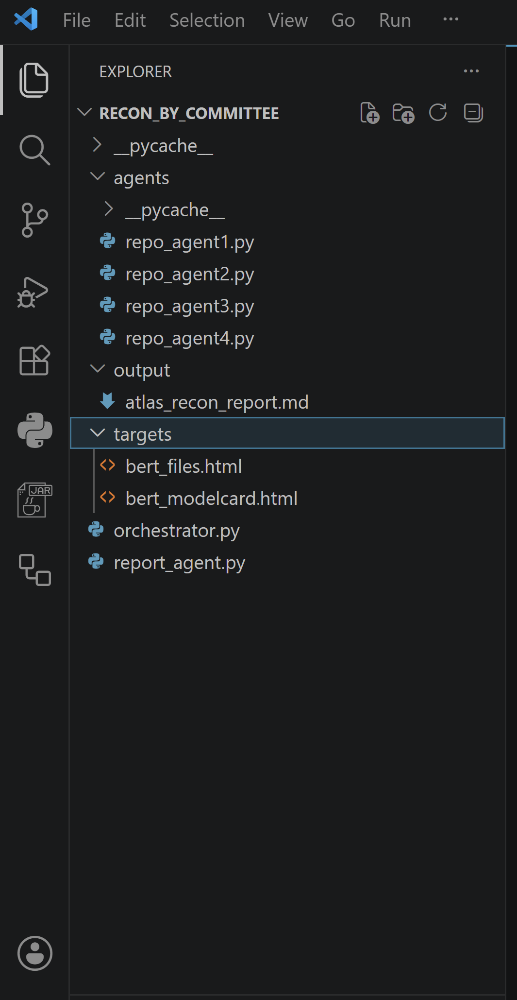
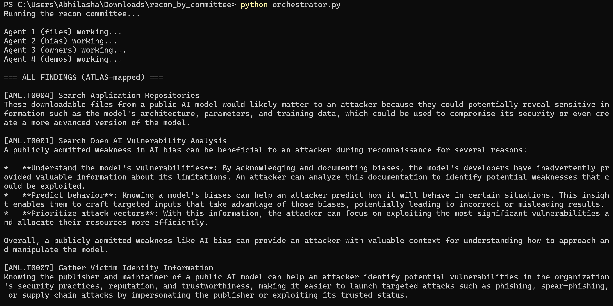
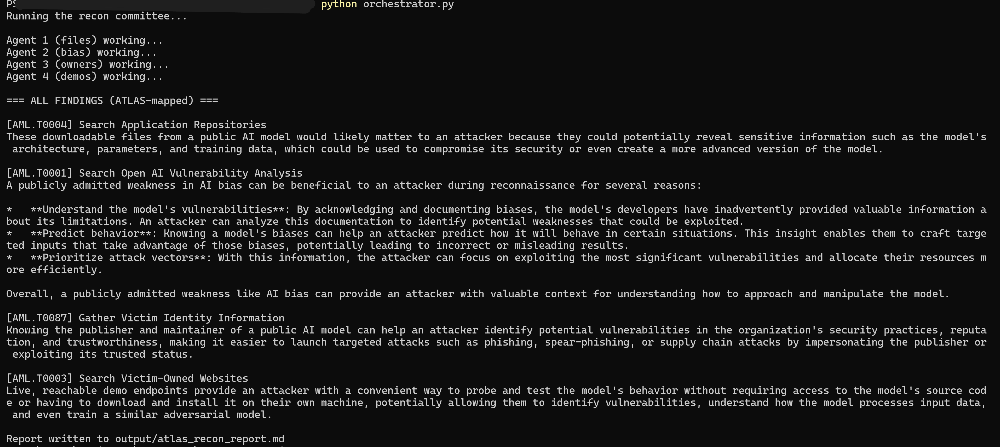
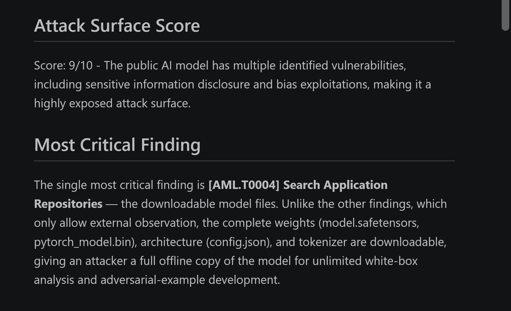

# Recon by Committee: Multi-Agent ATLAS Reconnaissance

A multi-agent reconnaissance system that analyzes a public machine-learning model's documentation and produces an intelligence report mapped to the [MITRE ATLAS](https://atlas.mitre.org/) framework, with a numeric attack-surface score, a named most-critical finding, and concrete evidence under each technique.

Four specialized agents each execute a different ATLAS Reconnaissance technique against a **saved, offline copy** of a public HuggingFace model card. An orchestrator coordinates them, and a report agent synthesizes their findings into a single ATLAS-mapped intelligence report.

> **Ethical scope:** All reconnaissance runs against *saved HTML copies* of public model documentation. The system never touches, probes, or scans any live service. Every analysis is offline, on files downloaded from a public page.

## Overview

The project splits every agent into two complementary layers:

- **Extraction** adapts to the page's structure and pulls concrete facts out of the saved HTML using deterministic parsing (BeautifulSoup), no AI involved.
- **Interpretation** hands those facts to a local LLM, which explains why each fact matters to an adversary.

**The core idea it demonstrates:** extraction controls *what the report knows* (grounded, parsed facts that can't be hallucinated), while the LLM controls *how the report reasons* (adversarial interpretation of real evidence). Separating the two keeps the security report accurate rather than invented.

## Stack

| Component | Tool |
|-----------|------|
| Agent reasoning | Llama 3.1 8B (local) |
| Local serving | Ollama |
| HTML parsing | BeautifulSoup |
| Language | Python |
| Threat framework | MITRE ATLAS |

## Target

The target is the public, Apache-2.0 licensed model [`google-bert/bert-base-uncased`](https://huggingface.co/google-bert/bert-base-uncased). Its model card and file listing are saved locally as HTML and used as offline targets, as no live requests are made.

## Architecture

Four independent agents, an orchestrator, and a report synthesizer.



Each agent is a self-contained module focused on one reconnaissance role. The orchestrator runs all four and collects their findings. The report agent turns those findings into the final ATLAS-mapped report.

## ATLAS Techniques Covered

| Agent | ATLAS ID | Technique | What it extracts |
|-------|----------|-----------|------------------|
| Repository | AML.T0004 | Search Application Repositories | Downloadable files - weights, config, tokenizer |
| Vulnerability | AML.T0001 | Search Open AI Vulnerability Analysis | Documented limitations & bias |
| Identity | AML.T0087 | Gather Victim Identity Information | Publisher / maintainer / license |
| Website | AML.T0003 | Search Victim-Owned Websites | Linked live demos & Spaces |

## Pipeline in Action

The orchestrator launches all four agents in sequence and prints their ATLAS-mapped findings before writing the report.



## Sample Findings

Each agent returns both the concrete evidence it found and an adversarial interpretation of it.



## Generated Report

The final report includes an executive summary, a numeric attack-surface score, an explicitly named most-critical finding, and concrete evidence (exact filenames, demo URLs, publisher) under each ATLAS technique.



## How to Run

Requires [Ollama](https://ollama.com/) running locally with a model pulled.

```bash
ollama pull llama3.1:8B
python orchestrator.py
```

The orchestrator runs the full committee and writes the report to `output/atlas_recon_report.md`.

## Pipeline Summary

**Reconnaissance:** saved model-card HTML → four agents extract facts (files, bias, identity, demos) → local LLM interprets each finding → orchestrator collects all four → report agent synthesizes → ATLAS-mapped intelligence report with attack-surface score, most-critical finding, and cited evidence.

## Repository Contents

- `agents/` - the four reconnaissance agents, one per ATLAS technique
- `orchestrator.py` - coordinates the agents and collects their findings
- `report_agent.py` - synthesizes the ATLAS-mapped intelligence report
- `targets/` - saved public model-card HTML (offline targets)
- `output/` - the generated intelligence report
- `screenshots/` - project screenshots

---
